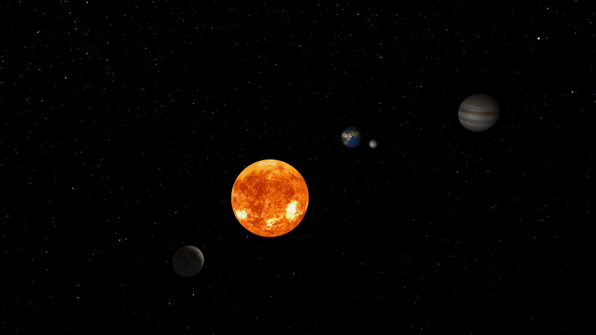

# Small solar system with variable planet and moon creation.

**AUTHOR Tobias Haubold**\
**2025-02-12**\
**Computergraphik WS24/25**

### laguages used

- c++
- c
- glsl
- cmake

### practices used

- texture loading
- uv mapping
- point light sources
- phong lighting
- light attenuation [ogre3d wiki](https://wiki.ogre3d.org/tiki-index.php?page=-Point+Light+Attenuation)
- cubemaps - skybox
- multi sampled anti aliasing 4x

## resources used
- glad
- glfw
- glm
- khr
- stb
- Sphere FROM [songho opengl](https://songho.ca/opengl/gl_sphere.html)
- textures from [SolarSystemScope](https://www.solarsystemscope.com/textures/)

Made with guidance from [LearnOpenGL](https://learnopengl.com/)

## preview



# How to use

prebuild .exe in build.zip

or build from source

# build

## linux

### System requirements:
- cmake
- make
- libglfw3-dev

```
mkdir build
cd build
cmake ..
make
```

## windows

### System requirements:
- CMake
- VS

```
mkdir build
cd build
cmake ..
cmake --build . --config Release
```

